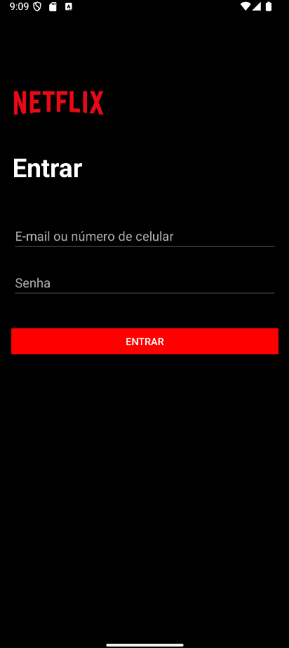
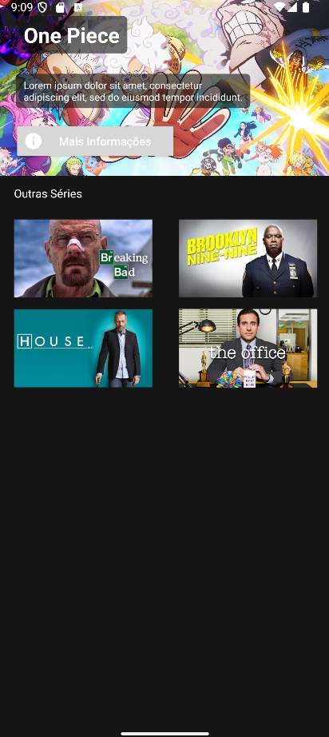
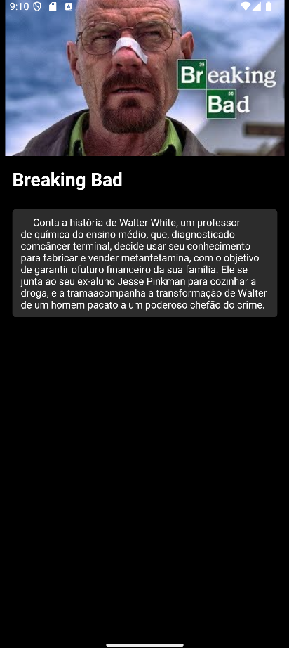
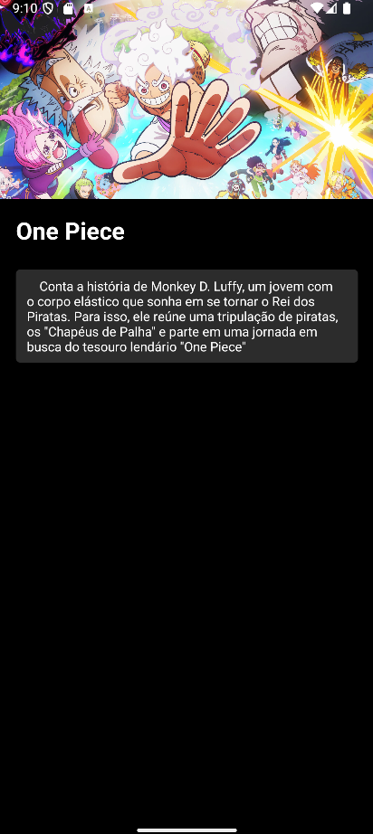

# 🎬 Netflix Clone App 

[](https://kotlinlang.org/)
[](https://gradle.org/)
[](https://developer.android.com/studio)

Um clone da interface da Netflix desenvolvido para Android, implementando alguns conceitos de desenvolvimento mobile com Kotlin.

## ✨ Recursos
- Interface fiel ao design original da Netflix
- Listagem de conteúdos em diferentes categorias
- Tela de detalhes com trailer
- Player de vídeo integrado
- Layout adaptativo para diferentes tamanhos de tela
- Navegação entre telas

## 📸 Screenshots

| Tela Inicial | Detalhes do Conteúdo | 
|--------------|-----------------------|
|  |  |

| Detalhes do Conteúdo | Detalhes do Conteúdo | 
|----------------------|----------------------|
|      |      |

## ⚙️ Instalação

1. Clone o repositório:
```bash
git clone https://github.com/seu-usuario/netflix-clone.git
